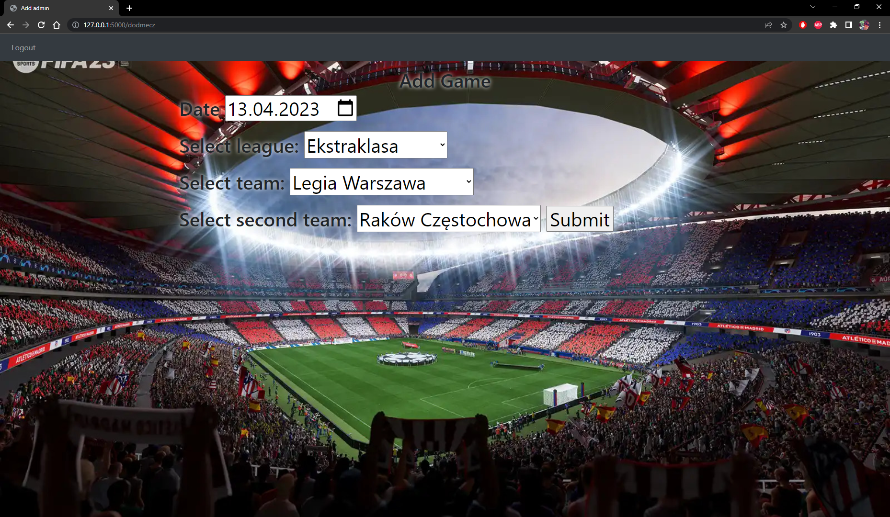

# Aplikacja Bukmacherska

Ta aplikacja webowa umożliwia zarządzanie zakładami sportowymi, logowanie jako administrator oraz użytkownik, oraz obstawianie meczy.

## Screenshots

1. Strona rejestracji


2. Panel administratora


3. Ekran dodawania meczu


4. Przeglądarka meczy


## Funkcjonalności

### Dla Administratora:

- Logowanie na konto administratora.
- Dodawanie nowych meczów do systemu.
- Ustalanie kursów dla poszczególnych meczów.
- Edycja oraz usuwanie meczów

### Dla Użytkownika:

- Logowanie na konto użytkownika.
- Wirtualne wpłacanie oraz wypłacanie środków z konta użytkownika.
- Obstawianie meczy.
- Automatyczne dodawanie wygranej do portfela użytkownika po wygraniu zakładu.
- Możliwość łączenia meczy na kuponie.

## Technologie

Aplikacja została zbudowana przy użyciu następujących technologii:

- Framework Flask do obsługi backendu.
- Baza danych SQLite do przechowywania danych użytkowników, meczów oraz kursów.
- HTML, CSS i JavaScript do budowy interfejsu użytkownika.

## Wymagania

Do uruchomienia aplikacji wymagane jest zainstalowanie następujących bibliotek Pythona:

- Flask
- Flask-SQLAlchemy

## Uruchomienie

Aby uruchomić aplikację, wykonaj następujące kroki:

1. Sklonuj repozytorium na swój komputer.
2. Zainstaluj wymagane biblioteki.
3. Uruchom aplikację przechodząc do folderu SQL i wpisując w terminalu:
    ```
    python main.py
    ```

Aplikacja będzie dostępna pod adresem http://localhost:5000/.
